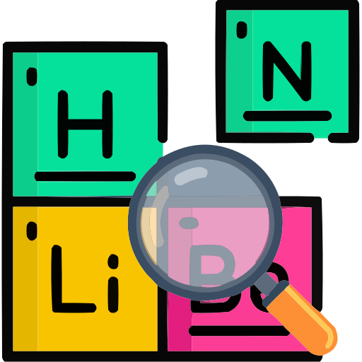
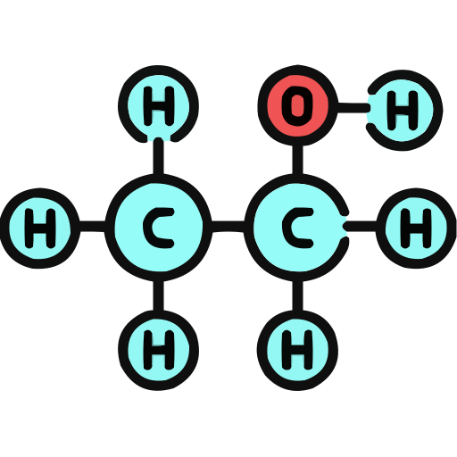
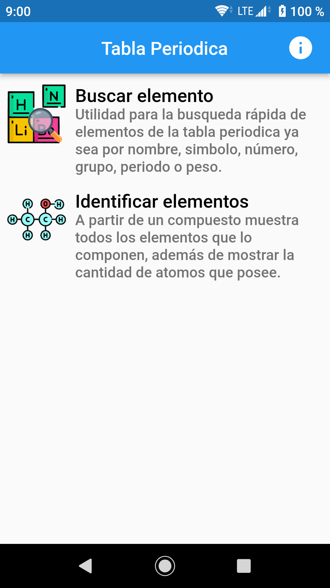
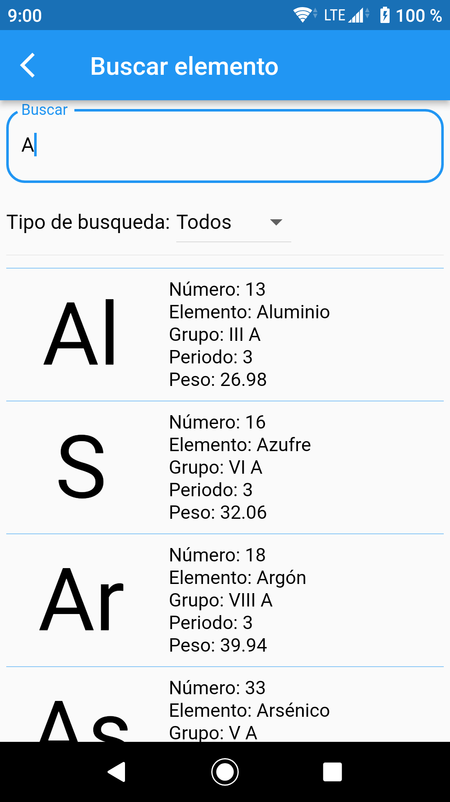
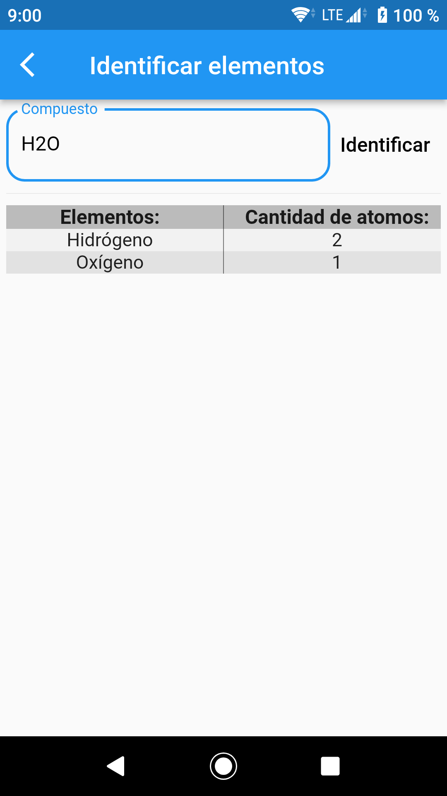

# Tabla Periodica

App para facilitar el uso de la tabla periódica (principalmente orientada a las necesidades de la materia **«Química Básica»** impartida por la **«Universidad Autónoma de Santo Domingo»**).

## Descargar
[**Tabla Periódica (apk)[Versión 1.0.0]**](https://github.com/Cedano-y-Cruz-Software/Tabla-Periodica/releases/download/1.0.0/Tabla-Periodica.apk)

## Herramientas o funcionalidades
### **Buscar elemento:**
<br>
Utilidad para la busqueda rápida de elementos de la tabla periódica ya sea por nombre, simbolo, número, grupo, periodo o peso.

### **Identificar elementos:**
<br>
A partir de un compuesto muestra todos los elementos que lo componen, además de mostrar la cantidad de atomos que posee.

## Notas de versión
```
- Herramientas agregas:
    Buscar elemento
    Identificar elementos
```

## Galería



